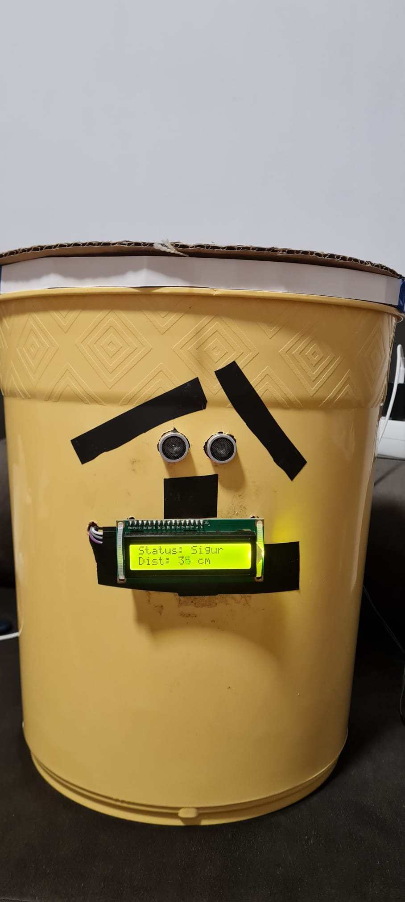
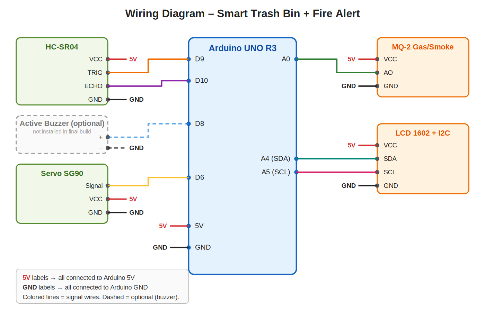

# 🗑️🔥 Embedded System for Waste Management and Fire Protection

An Arduino project that combines an **automatic trash bin** with a **smoke/gas alert system**, with the system status shown on an LCD screen.

> Inspired by [this video tutorial](https://www.youtube.com/watch?v=9yrP1CZN3Ds&t=3s), extended with an MQ-2 smoke/gas sensor and an alarm system.

  

## 📖 Overview

The project has two main features:

1. **Automatic trash bin** – an ultrasonic sensor detects when a hand (or object) approaches, and the lid opens automatically. Once nothing is detected anymore, the lid closes.
2. **Fire safety system** – an MQ-2 sensor monitors the air. If smoke or gas is detected, the system switches to alert mode: the lid closes and stays closed for as long as the danger persists, and the LCD shows a warning. The code also drives an **optional buzzer** (pin D8), which was not installed in the final build due to lack of space.

A **1602 LCD** mounted on the front of the bin displays the system status:

| State | Line 1 | Line 2 |
|-------|--------|--------|
| Normal operation | `Status: Sigur` | `Dist: XX cm` |
| Fire alert | `!! PERICOL !!` | `DETECTIE FUM` |

> The on-screen messages are in Romanian ("Sigur" = Safe, "PERICOL" = Danger, "DETECTIE FUM" = Smoke detected).

## 🧰 Components

| Component | Model |
|-----------|-------|
| Development board | Arduino UNO R3 |
| Distance sensor | HC-SR04 (ultrasonic) |
| Smoke/gas sensor | MQ-2 module |
| Display | 1602 LCD with I2C module |
| Servo motor | SG90 |
| Audible alarm *(optional)* | Active buzzer – supported in the code, not installed in the final build |
| Prototyping | Breadboard (or mini breadboard shield) + jumper wires |
| Power | DC barrel jack adapter, up to 9 V / 0.6 A (recommended) or USB cable |

## 🔌 Wiring

| Component | Component pin | Arduino pin |
|-----------|---------------|-------------|
| HC-SR04 | VCC / GND | 5V / GND |
| HC-SR04 | TRIG | D9 |
| HC-SR04 | ECHO | D10 |
| SG90 servo | Signal (orange/yellow) | D6 |
| SG90 servo | VCC / GND | 5V / GND |
| MQ-2 | AO (analog output) | A0 |
| MQ-2 | VCC / GND | 5V / GND |
| Active buzzer *(optional)* | + | D8 |
| Active buzzer *(optional)* | − | GND |
| I2C LCD | SDA | A4 |
| I2C LCD | SCL | A5 |
| I2C LCD | VCC / GND | 5V / GND |

> 💡 **Tip:** the connections can be made either on a standard breadboard or with a **mini breadboard shield** that plugs directly on top of the Arduino UNO. The shield makes the build more compact and the wiring more stable, which is handy when everything has to fit inside the trash bin. The pin mapping stays exactly the same.

> 🔔 **Buzzer:** the buzzer is defined in the code and shown in the diagram as optional (dashed), but it was **not physically connected** in the final build because there was no room left. The system works fully without it: the lid locks and the LCD shows the alert. To enable the audible alarm, simply connect an active buzzer to D8 and GND.

## 🔋 Power Supply

The recommended way to power the board is a **DC power adapter with a barrel jack plug, up to 9 V and 0.6 A**, plugged into the Arduino UNO's power jack.

- The Arduino's onboard regulator turns the input voltage into the 5 V that feeds the sensors, the servo and the LCD.
- 0.6 A is enough for this project, but the servo draws extra current when it moves. If you notice resets or erratic behavior, use a stronger adapter or a separate 5 V supply for the servo (with a common GND).
- The Arduino UNO accepts 7–12 V on the jack (9 V is a good choice). Check that the plug is the standard 5.5 × 2.1 mm type with **positive center**.
- Alternatively, the board can be powered through the USB cable (also used for uploading the code).

## ⚙️ How It Works

The code runs in a continuous loop, with **safety taking priority**:

1. The MQ-2 sensor is read. If the analog value exceeds the threshold (`500`):
   - the buzzer output (D8) is switched on – if a buzzer is connected,
   - the lid is forced into the **closed** position (servo at `120°`),
   - the LCD shows the danger message.
2. If there is no danger:
   - the buzzer output is switched off,
   - the distance is measured with the HC-SR04 and shown on the LCD,
   - if the distance is **below 20 cm**, the servo pulls the lid string (position `0°`) and keeps the lid open for **3 seconds**,
   - otherwise, the lid stays closed (servo at `120°`).

The lid is operated by the servo through a **string**: at `0°` the string is pulled (lid open), and at `120°` it is slack (lid closed).

### Code Structure

The code is object-oriented, with three simple classes:

- `Ultrasonic` – reads the distance in cm from the HC-SR04
- `SmokeSensor` – compares the reading against a threshold and reports whether the alarm is active
- `Alert` – turns the buzzer on/off

## 🚀 Installation and Usage

1. Install the [Arduino IDE](https://www.arduino.cc/en/software).
2. Install the **LiquidCrystal I2C** library from *Sketch → Include Library → Manage Libraries*.
   (`Servo` and `Wire` are included by default.)
3. Connect the components according to the wiring table above.
4. Open the `.ino` file from this repo, select the **Arduino UNO** board and the correct port.
5. Click **Upload**.

## 🔧 Configuration

Values you can adjust in the code:

| Parameter | Default | Description |
|-----------|---------|-------------|
| `LiquidCrystal_I2C lcd(0x27, ...)` | `0x27` | I2C address of the LCD (some modules use `0x3F`) |
| `SmokeSensor gasSensor(FUM_PIN, 500)` | `500` | Smoke/gas detection threshold (0–1023) |
| `dist < 20` | `20 cm` | Distance at which the lid opens |
| `delay(3000)` | `3 s` | How long the lid stays open |
| `myServo.write(0 / 120)` | `0° / 120°` | Servo positions (open / closed), depending on your mounting |

## ⚠️ Notes

- The **MQ-2 sensor needs a few minutes to warm up** on first power-up for stable readings; the threshold may need calibrating for the air in your room.
- This is an **educational prototype** and does not replace a certified smoke detector.
- If the servo is noisy or the Arduino resets, use a separate 5V supply for the servo (with a common GND).

## 💡 Possible Improvements

- Replace `delay()` with `millis()` for non-blocking operation
- Install the buzzer (e.g. by moving the build to a bigger enclosure or a custom PCB)
- Add a warning LED
- Automatic MQ-2 threshold calibration
- Wireless notifications (ESP8266/ESP32)
